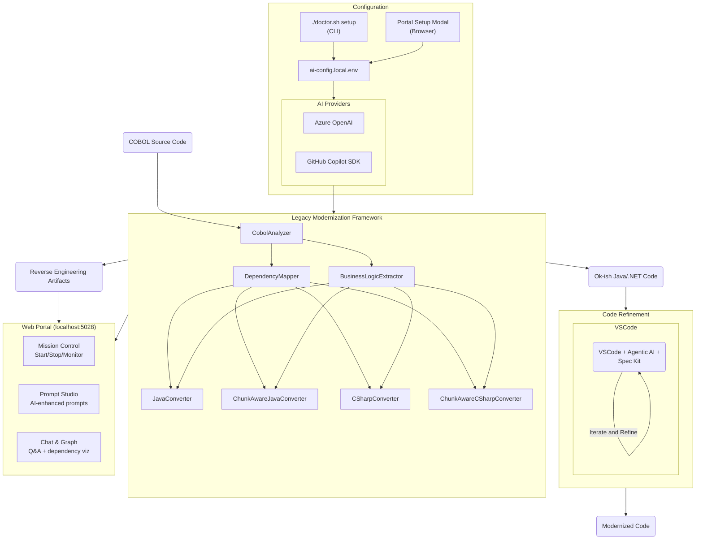

```mermaid
flowchart TD
    COBOL(COBOL Source Code)
    
    subgraph CONFIG["Configuration"]
        DOCTOR["./doctor.sh setup<br/>(CLI)"]
        PORTAL_SETUP["Portal Setup Modal<br/>(Browser)"]
        DOCTOR --> ENV["ai-config.local.env"]
        PORTAL_SETUP --> ENV
        ENV --> PROVIDERS
        subgraph PROVIDERS["AI Providers"]
            AZURE["Azure OpenAI"]
            COPILOT["GitHub Copilot SDK"]
        end
    end

    COBOL --> A

    subgraph LMF[Legacy Modernization Framework]
        A[CobolAnalyzer] --> B[DependencyMapper]
        A --> C[BusinessLogicExtractor]
        B --> D[JavaConverter]
        B --> E[ChunkAwareJavaConverter]
        C --> D
        C --> E
        B --> F[CSharpConverter]
        B --> G[ChunkAwareCSharpConverter]
        C --> F
        C --> G
    end

    PROVIDERS --> LMF

    LMF --> H(Ok-ish Java/.NET Code)
    H --> PostLMF
    subgraph PostLMF[Code Refinement]
       subgraph VSCode[VSCode]
            I(VSCode + Agentic AI + <br> Spec Kit)
            I -- Iterate and Refine --> I
        end 
    end
    LMF --> K(Reverse Engineering Artifacts)
    PostLMF --> J(Modernized Code)

    subgraph PORTAL["Web Portal (localhost:5028)"]
        MC["Mission Control<br/>Start/Stop/Monitor"]
        PS["Prompt Studio<br/>AI-enhanced prompts"]
        CHAT["Chat & Graph<br/>Q&A + dependency viz"]
    end

    LMF --> PORTAL
    K --> PORTAL
```
